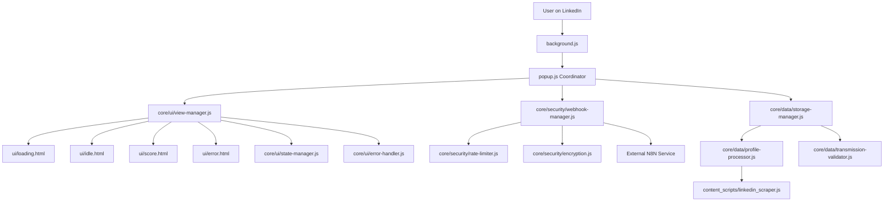

# LinkedIn Insight V2.1 - System Patterns & Updated Architecture Documentation

## Updated `rules/system.md` Content

Below is the complete, updated content for the `rules/system.md` file, incorporating V2.1 architectural decisions while preserving relevant V2 foundations:

---

# System Architecture & Design Patterns (`rules/system.md`)

**This document is the canonical source for LinkedIn Insight V2.1's system architecture, design patterns, and technical guidelines. All development work must align with the principles and structures outlined herein. Deviations require explicit approval and documentation.**

## 1. Overall Architecture Philosophy

**Enhanced Modular Monolith within Chrome Extension Context**

LinkedIn Insight V2.1 employs an enhanced modular monolith architecture that maintains the simplicity and rapid development benefits of V2 while addressing critical security vulnerabilities and UX integration gaps. The architecture prioritizes:

- **Security by design:** Progressive security implementation with proper separation of concerns
- **Modular separation:** Clear boundaries between security, data, and UI layers  
- **Chrome Extension constraints:** Working within browser extension limitations while maximizing modularity
- **Future enterprise readiness:** Architecture supports migration to enterprise API without fundamental restructuring
- **Progressive enhancement:** Incremental improvements without breaking existing functionality



## 2. Chrome Extension System Patterns

### 2.1. Core Extension Architecture

**Modular Monolith with Enhanced Security Layer**

The V2.1 architecture maintains the core Chrome Extension structure while introducing a new `core/` module system that provides:

- **Security isolation:** Sensitive operations handled in dedicated security modules
- **UI consistency:** Centralized view management for smooth user experience
- **Data reliability:** Validation and processing layer before external transmission
- **Error resilience:** Strategy-based error handling with recovery mechanisms

**Key architectural constraints:**
- Chrome Extension Manifest V3 compliance
- Communication via Chrome messaging APIs and storage events
- No direct module imports between extension contexts (popup, content script, background)
- Client-side security measures with encrypted local storage

### 2.2. Key Chrome Extension Design Patterns

**Pattern 1: Enhanced Module Pattern with Security Isolation**
```javascript
// core/security/webhook-manager.js
export class WebhookManager {
  constructor(storageManager, encryption) {
    this.storage = storageManager;
    this.encryption = encryption;
  }
  
  async getSecureWebhookUrl() {
    const encrypted = await this.storage.get('webhookUrl');
    return await this.encryption.decrypt(encrypted);
  }
  
  async setWebhookUrl(url) {
    await this.validateUrl(url);
    const encrypted = await this.encryption.encrypt(url);
    await this.storage.set('webhookUrl', encrypted);
  }
}
```

**Pattern 2: Facade Pattern for View Management**
```javascript
// core/ui/view-manager.js
export class ViewManager {
  constructor(stateManager, errorHandler) {
    this.state = stateManager;
    this.errorHandler = errorHandler;
  }
  
  async showView(viewName, data = {}) {
    try {
      await this.loadHTML(viewName);
      this.bindEvents(viewName);
      this.state.updateView(viewName, data);
      await this.transitionIn();
    } catch (error) {
      this.errorHandler.handle(error, { view: viewName, data });
    }
  }
  
  async showLoading() { await this.showView('loading'); }
  async showIdle() { await this.showView('idle'); }
  async showScore(scoreData) { await this.showView('score', scoreData); }
}
```

**Pattern 3: Strategy Pattern for Error Handling**
```javascript
// core/ui/error-handler.js
export class ErrorHandler {
  constructor() {
    this.strategies = {
      'network': new NetworkErrorStrategy(),
      'scraping': new ScrapingErrorStrategy(),
      'n8n': new N8NErrorStrategy(),
      'security': new SecurityErrorStrategy()
    };
  }
  
  handle(error, context) {
    const strategy = this.getStrategy(error.type) || this.strategies.default;
    return strategy.handle(error, context);
  }
}
```

### 2.3. Extension Component Relationships & Communication

**Primary Communication Flows:**

1. **User Profile Detection Flow:**
```
LinkedIn Page Load → background.js detects URL → 
popup.js coordinator → ViewManager.showIdle() or ViewManager.showMain()
```

2. **Profile Analysis Flow:**
```
User clicks analyze → ViewManager.showLoading() → 
linkedin_scraper.js extraction → ProfileProcessor.validate() → 
WebhookManager.secureTransmit() → N8N → ViewManager.showScore()
```

3. **Error Recovery Flow:**
```
Any component error → ErrorHandler.handle() → 
ViewManager.showError() with context-specific guidance → 
User retry action → appropriate recovery strategy
```

**Communication Patterns:**
- **Cross-context messaging:** `chrome.runtime.sendMessage` / `chrome.scripting.executeScript`
- **State persistence:** `chrome.storage.local` via StorageManager abstraction
- **Event coordination:** Custom event system within popup context
- **Error propagation:** Centralized ErrorHandler with context preservation

### 2.4. Extension Directory Structure (V2.1)

```
extension/
├── manifest.json                       # Enhanced security permissions
├── _locales/en/messages.json           # Internationalization
├── background/
│   └── background.js                   # URL detection & popup triggers
├── icons/                              # Extension icons
├── content_scripts/
│   └── linkedin_scraper.js             # DOM scraping (unchanged from V2)
├── core/                               # NEW: Modular business logic
│   ├── security/                       # Security isolation layer
│   │   ├── webhook-manager.js          # Encrypted webhook configuration
│   │   ├── rate-limiter.js             # Progressive rate limiting
│   │   └── encryption.js               # Web Crypto API wrapper
│   ├── data/                          # Data processing & validation
│   │   ├── storage-manager.js          # Chrome storage abstraction
│   │   ├── profile-processor.js        # Profile data processing
│   │   └── transmission-validator.js   # Pre-N8N validation
│   └── ui/                            # UI management & state
│       ├── view-manager.js             # Dynamic view loading
│       ├── state-manager.js            # UI state coordination
│       └── error-handler.js            # Centralized error handling
├── popup/
│   ├── popup.html                      # Single popup entry point
│   ├── popup.js                        # Lightweight coordinator
│   └── popup.css                       # Popup styling
├── settings/                           # Enhanced settings with validation
│   ├── settings.html
│   ├── settings.js                     # Input validation & encryption
│   └── settings.css
└── ui/                                 # Simplified view templates
    ├── main.html                       # Main interface (resume removed)
    ├── loading.html                    # Integrated loading screen
    ├── idle.html                       # Integrated idle screen
    ├── score.html                      # Score display (renamed)
    ├── profile.html                    # Profile view
    └── error.html                      # Enhanced error handling
```

## 3. Security System Patterns

### 3.1. Progressive Security Architecture

**Security-First Design with Backward Compatibility**

V2.1 implements progressive security that eliminates V2 vulnerabilities while maintaining user experience:

- **Encrypted configuration:** All sensitive data encrypted using Web Crypto API
- **Rate limiting foundation:** Client-side rate limiting with configurable thresholds
- **Input validation:** Real-time validation for URLs and data integrity
- **Secure transmission:** Webhook URLs stored encrypted, never exposed in client code

**Security Layers:**
1. **Input layer:** URL format validation, data sanitization
2. **Storage layer:** Automatic encryption/decryption via StorageManager
3. **Transmission layer:** Rate limiting, request validation
4. **Monitoring layer:** Security event logging with privacy preservation

### 3.2. Key Security Patterns

**Encrypted Storage Pattern:**
```javascript
// core/data/storage-manager.js
export class StorageManager {
  constructor(encryption) {
    this.encryption = encryption;
  }
  
  async setSecure(key, value) {
    const encrypted = await this.encryption.encrypt(JSON.stringify(value));
    return chrome.storage.local.set({ [key]: encrypted });
  }
  
  async getSecure(key) {
    const result = await chrome.storage.local.get(key);
    if (!result[key]) return null;
    const decrypted = await this.encryption.decrypt(result[key]);
    return JSON.parse(decrypted);
  }
}
```

**Rate Limiting Pattern:**
```javascript
// core/security/rate-limiter.js
export class RateLimiter {
  constructor(maxRequests = 10, windowMs = 60000) {
    this.maxRequests = maxRequests;
    this.windowMs = windowMs;
  }
  
  async canMakeRequest(userId = 'default') {
    const requests = await this.getRequestHistory(userId);
    const validRequests = this.filterValidRequests(requests);
    return validRequests.length < this.maxRequests;
  }
}
```

## 4. UI/UX System Patterns

### 4.1. View Management Architecture

**Centralized View Coordination with State Management**

The ViewManager provides a unified interface for all UI transitions while maintaining separation between view logic and business logic:

- **Smooth transitions:** Loading states properly integrated with actual processing time
- **Context awareness:** Idle screen for user's own profile, analysis for others
- **Error resilience:** Graceful error handling with recovery options
- **Responsive design:** No scrolling required, adaptive to extension viewport

### 4.2. Key UI Patterns

**State Management Pattern:**
```javascript
// core/ui/state-manager.js
export class StateManager {
  constructor() {
    this.state = {
      currentView: 'main',
      userData: null,
      targetData: null,
      scoreData: null,
      isLoading: false,
      error: null
    };
    this.listeners = new Map();
  }
  
  updateState(updates) {
    const previousState = { ...this.state };
    this.state = { ...this.state, ...updates };
    this.notifyListeners(previousState, this.state);
  }
}
```

**Dynamic View Loading Pattern:**
```javascript
// View loading with proper event binding
async loadHTML(viewName) {
  const response = await fetch(`../ui/${viewName}.html`);
  const html = await response.text();
  document.getElementById('view-container').innerHTML = html;
  await this.bindViewEvents(viewName);
}
```

### 4.3. UI Component Integration Points

**View Integration Mapping:**
- **main.html:** Entry point for profile analysis (resume upload removed)
- **loading.html:** Displays during LinkedIn scraping and N8N processing
- **idle.html:** Shows when extension detects user's own LinkedIn profile
- **score.html:** Displays networking score with contextual information
- **error.html:** Context-aware error messages with recovery actions

## 5. Cross-Cutting Concerns & Platform-Wide Patterns

### 5.1. Error Handling Strategy

**Context-Aware Error Management with Recovery Options**

- **Error categorization:** Network, scraping, N8N, security, and validation errors
- **User-friendly messaging:** Plain language explanations with suggested actions
- **Recovery mechanisms:** Automatic retry for transient errors, manual retry for user errors
- **Privacy-conscious logging:** Local error logging without external transmission

### 5.2. Data Validation & Processing

**Multi-Layer Validation with Type Safety**

```javascript
// core/data/transmission-validator.js
export class TransmissionValidator {
  validateProfileData(profileData) {
    const required = ['name', 'headline', 'location'];
    const missing = required.filter(field => !profileData[field]);
    
    if (missing.length > 0) {
      throw new ValidationError(`Missing required fields: ${missing.join(', ')}`);
    }
    
    return this.sanitizeData(profileData);
  }
}
```

### 5.3. Configuration Management

**Encrypted Configuration with Migration Support**

- **Secure storage:** All sensitive configuration encrypted at rest
- **Migration strategy:** Automatic detection and migration of V2 hardcoded configurations
- **Validation:** Real-time URL format validation with user feedback
- **Backup/restore:** Configuration export/import for user convenience

### 5.4. Performance Optimization

**Chrome Extension Performance Best Practices**

- **Memory management:** Proper cleanup of event listeners and DOM references
- **Loading optimization:** Progressive loading with perceived performance improvements
- **Storage efficiency:** Minimal storage footprint with compression for large data
- **Background processing:** Efficient background script with event-driven architecture

## 6. Key Technology Stack Summary

### 6.1. Core Technologies

**Client-Side Stack:**
- **JavaScript ES6+:** Module system, async/await, proper error handling
- **Chrome Extension APIs:** Storage, scripting, runtime messaging, tabs
- **Web Crypto API:** Client-side encryption for sensitive configuration
- **HTML5 & CSS3:** Semantic markup with Tailwind CSS utility framework

**Storage & Security:**
- **Chrome Storage Local:** Encrypted local storage via StorageManager
- **Web Crypto API:** AES-GCM encryption for webhook URLs and sensitive data
- **Input validation:** Real-time validation for URLs and data integrity
- **Rate limiting:** Client-side request throttling with configurable limits

### 6.2. External Integrations

**N8N Webhook Integration:**
- **Secure transmission:** Encrypted webhook URL storage
- **Data validation:** Pre-transmission validation of profile data
- **Error handling:** Comprehensive error handling for N8N responses
- **Rate limiting:** Progressive rate limiting to prevent abuse

**LinkedIn Integration:**
- **DOM scraping:** content_scripts/linkedin_scraper.js (unchanged from V2)
- **Profile detection:** Background script URL monitoring
- **Data extraction:** Structured data extraction with validation

### 6.3. Development & Testing

**Development Tools:**
- **Module system:** ES6 modules with clear dependency management
- **Error handling:** Comprehensive error logging and user feedback
- **Testing strategy:** Unit tests for core modules, integration tests for workflows
- **Code organization:** Single responsibility principle with modular architecture

---

## V2.1 Migration Guidelines

### Implementation Phases

**Phase 1: Security Foundation**
1. Implement core/security/ modules with encryption and rate limiting
2. Migrate hardcoded webhook configurations to encrypted storage
3. Add input validation to settings interface
4. Test security measures with existing N8N workflow

**Phase 2: UI/UX Integration**
1. Implement core/ui/ modules for view and state management
2. Integrate idle.html and loading.html through ViewManager
3. Remove resume upload from main.html to eliminate scrolling
4. Test smooth transitions and error handling

**Phase 3: Data Reliability**
1. Implement core/data/ modules for validation and processing
2. Add retry logic for failed N8N communications
3. Enhance error handling with specific error types
4. Test data accuracy and validation

**Backward Compatibility:**
- Automatic detection of V2 configurations
- Graceful migration to encrypted storage
- Fallback mechanisms for compatibility issues
- Clear user communication about changes

*This document should be reviewed and updated as the system evolves.* 