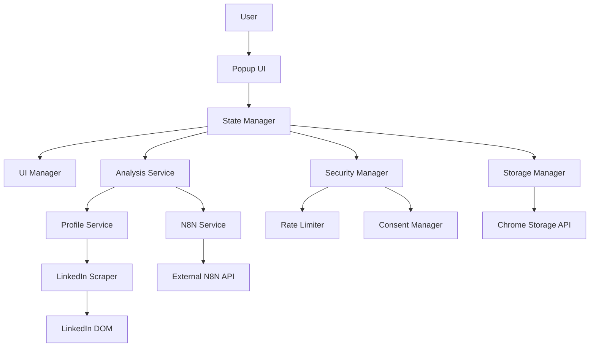
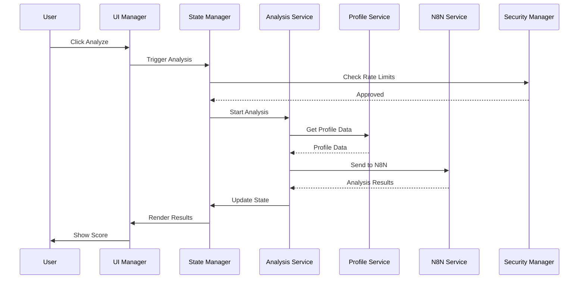

# System Architecture & Design Patterns (`rules/system.md`)

**This document is the canonical source for the project's system architecture, design patterns, and technical guidelines. All development work must align with the principles and structures outlined herein. Deviations require explicit approval and documentation.**

## 1. Overall Architecture Philosophy

**Enhanced Modular Monolith with Layered Architecture (Chrome Extension Context)**

The V3 architecture adopts a **security-first, modular monolith** approach organized into distinct layers that balance simplicity with robust security and maintainability. This design philosophy emphasizes separation of concerns, scalability within the Chrome extension ecosystem, and comprehensive testing capabilities.

**Core Architectural Principles:**
- **Security-First Design**: Addresses LinkedIn ToS compliance and user privacy concerns through centralized security controls
- **Separation of Concerns**: Clear boundaries between UI, business logic, and data layers enable independent development and testing
- **Modular Design**: Small, focused modules that are easy to understand, maintain, and test individually
- **Diagnostic Capabilities**: Built-in debugging and monitoring infrastructure for development and troubleshooting
- **Testing-Friendly**: Modular structure enables comprehensive unit and integration testing with mock data support



## 2. Backend System Patterns

### 2.1. Core Backend Architecture

**Service-Oriented Layered Architecture within Chrome Extension Context**

The backend follows a layered approach optimized for Chrome extension development:

- **Presentation Layer** (`popup/`, `ui/`): User interface components and screens
- **Application Layer** (`services/`): Business logic orchestration and API integration
- **Domain Layer** (`core/`): Core business rules, validation, and security policies
- **Infrastructure Layer** (`background/`, `content/`): System-level operations and external integrations

This layered approach ensures dependencies flow in one direction (top-down), making the system more maintainable and testable while respecting Chrome extension security constraints.

### 2.2. Key Backend Design Patterns

**1. Module Pattern (ES6 Modules)**
- **Purpose**: Encapsulates related functionality into discrete, importable modules with clear public interfaces
- **Application**: Each service (`n8n-service.js`, `profile-service.js`, `analysis-service.js`) exports specific functionality while keeping implementation details private
- **Benefits**: Prevents namespace pollution, enables tree-shaking for better performance, and improves code organization in the JavaScript environment

**2. Facade Pattern**
- **Purpose**: Provides a simplified interface to complex subsystems, hiding implementation complexity from clients
- **Application**: `ui-manager.js` acts as a facade for all UI operations, abstracting the complexity of managing multiple HTML screens, state transitions, and component lifecycle
- **Benefits**: Simplifies popup logic, centralizes UI state management, and provides a clean API for the main popup controller

**3. Strategy Pattern**
- **Purpose**: Defines interchangeable algorithms or approaches, allowing runtime selection based on context
- **Application**: `analysis-service.js` switches between different analysis strategies (live N8N, mock data, cached results) based on diagnostic mode settings and availability
- **Benefits**: Enables easy testing with mock data, supports multiple analysis backends, and allows runtime configuration changes without code modification

**4. Security Manager Pattern (Cross-Cutting)**
- **Purpose**: Centralizes security controls and policies across all system components
- **Application**: `security-manager.js` enforces rate limits, manages user consent, validates input data, and ensures consistent security policies across all layers
- **Benefits**: Provides single point of security control, ensures compliance with privacy regulations, and simplifies security auditing

### 2.3. Backend Component Relationships & Flows

**Primary Data Flow Architecture:**
1. **User Interaction** → UI components trigger state changes through event handlers
2. **State Manager** → Orchestrates business logic by coordinating service calls
3. **Analysis Service** → Manages the complete analysis workflow from data collection to result presentation
4. **Profile Service** → Handles LinkedIn profile data extraction and validation
5. **N8N Service** → Manages external API communication with security controls and error handling
6. **Security Manager** → Enforces rate limits, user consent, and data protection policies across all operations



### 2.4. Backend Module/Directory Structure

```
extension/src/
├── popup/
│   ├── components/
│   │   ├── ui-manager.js          # Facade for UI operations
│   │   ├── state-manager.js       # Centralized state management
│   │   └── webhook-client.js      # N8N webhook communication
│   ├── index.html
│   ├── popup.js
│   └── popup.css
├── content/
│   ├── linkedin-scraper.js        # LinkedIn DOM interaction
│   ├── profile-parser.js          # Profile data extraction
│   └── dom-utils.js               # DOM manipulation utilities
├── background/
│   ├── service-worker.js          # Background task coordination
│   ├── rate-limiter.js            # Request throttling
│   └── storage-manager.js         # Chrome storage abstraction
├── core/
│   ├── config.js                  # Application configuration
│   ├── constants.js               # System constants
│   ├── validators.js              # Input validation
│   └── security/
│       ├── consent-manager.js     # User consent handling
│       ├── rate-limits.js         # Rate limiting policies
│       └── data-protection.js     # Data privacy controls
├── services/
│   ├── n8n-service.js             # N8N API integration
│   ├── profile-service.js         # Profile data management
│   ├── analysis-service.js        # Analysis orchestration
│   └── mock-data-service.js       # Testing data provider
└── utils/
    ├── logger.js                  # Centralized logging
    ├── crypto.js                  # Cryptographic operations
    ├── error-handler.js           # Error management
    └── test-helpers.js            # Testing utilities
```

## 3. Frontend System Patterns

### 3.1. Core Frontend Architecture

**Component-Based UI with Centralized State Management**

The frontend architecture emphasizes vanilla JavaScript ES6+ for Chrome extension compatibility while maintaining modern development practices:

- **Vanilla JavaScript ES6+**: Ensures compatibility and reduces security attack surface
- **Modular UI Components**: Clear separation of concerns with reusable components
- **Event-Driven State Updates**: Reactive UI updates through centralized state management
- **Progressive Enhancement**: Graceful degradation for better user experience across different scenarios

### 3.2. Key Frontend Technical Decisions & Patterns

**State Management Strategy:**
- **Centralized State**: `state-manager.js` implements single source of truth for application state
- **Event-Driven Updates**: UI components subscribe to state changes for reactive updates
- **Immutable State**: State updates follow immutable patterns for predictability and debugging

**UI Component Organization:**
- **Facade Pattern**: `ui-manager.js` provides simplified interface to complex UI operations
- **Component Lifecycle**: Proper initialization and cleanup for popup context management
- **Dynamic View Loading**: Runtime loading of HTML views with component-specific logic

**Error Handling Approach:**
- **Error Boundaries**: Comprehensive error catching with user-friendly recovery options
- **Graceful Degradation**: System continues to function when external services are unavailable
- **Diagnostic Mode**: Enhanced debugging capabilities for development and troubleshooting

### 3.3. Frontend Component Relationships & Structure

**UI Component Hierarchy:**
```
Popup Shell (popup.html)
├── UI Manager (Facade)
│   ├── View Management
│   ├── Component Lifecycle
│   └── Event Coordination
├── State Manager (Central State)
│   ├── Application State
│   ├── User Preferences
│   └── Analysis Results
├── View Components
│   ├── Score Screen (score.html)
│   ├── Profile Screen (profile.html)
│   ├── Loading Screen (loading.html)
│   ├── Error Screen (error.html)
│   └── Diagnostic Screen (diagnostic.html)
└── Utility Components
    ├── Score Wheel Visualization
    ├── Profile Card Display
    └── Error Recovery Interface
```

### 3.4. Critical Frontend Implementation Paths/Flows

**Primary User Interaction Flow:**
1. **Extension Activation** → Auto-popup detection or manual trigger based on LinkedIn context
2. **Profile Detection** → LinkedIn page analysis and profile data extraction
3. **User Consent** → Privacy-compliant data collection with clear user acknowledgment
4. **Analysis Request** → Secure N8N service call with rate limiting and validation
5. **Loading State** → Progress indicators and user feedback during processing
6. **Results Display** → Score visualization and networking insights presentation
7. **Error Recovery** → Graceful failure handling with retry options and user guidance

## 4. Cross-Cutting Concerns & Platform-Wide Patterns

**Error Handling Strategy:**
- **Standardized Error Propagation**: Try/catch blocks with consistent error object structure
- **User-Friendly Messaging**: Technical errors translated to actionable user guidance
- **Diagnostic Mode Integration**: Detailed error information available in development mode
- **Retry Mechanisms**: Automatic and manual retry options for transient failures
- **Graceful Degradation**: Core functionality maintained even when external services fail

**Logging and Monitoring:**
- **Centralized Logging**: All logging flows through `utils/logger.js` for consistency
- **Conditional Debug Logging**: Detailed logging enabled only in diagnostic mode
- **Structured Logging**: Consistent log format with context, severity, and timestamps
- **Privacy Compliance**: No external logging services to maintain user privacy

**Security Architecture:**
- **HMAC Signature Verification**: Webhook authenticity validation for N8N communication
- **Rate Limiting Enforcement**: Multi-tier rate limiting (client-side and server-side coordination)
- **User Consent Management**: Privacy-first data collection with explicit user acknowledgment
- **Input Validation and Sanitization**: Comprehensive data validation for all user inputs and external data
- **Secure Storage Practices**: Proper use of Chrome Storage API with data minimization principles

**Configuration Management:**
- **Environment-Specific Configuration**: Settings managed through `core/config.js` for different deployment contexts
- **User Preferences**: Persistent user settings stored securely in Chrome Storage
- **Runtime Configuration**: Diagnostic and testing modes with runtime feature toggles
- **Secure Credential Handling**: Webhook URLs and sensitive configuration stored securely

**API Design and Communication:**
- **RESTful N8N Integration**: Structured JSON communication with standardized request/response formats
- **Bidirectional Webhook Support**: Both POST (request) and GET/PUT (response) webhook patterns
- **Comprehensive Error Responses**: Meaningful error messages with appropriate HTTP status codes
- **Timeout and Retry Logic**: Network resilience with configurable timeout and retry policies

**Testing Strategy and Quality Assurance:**
- **Unit Testing**: Individual service modules tested in isolation with comprehensive coverage
- **Integration Testing**: End-to-end workflow validation with mock external services
- **Mock Data Services**: Development-friendly testing infrastructure without live LinkedIn data
- **Chrome Extension Testing**: Platform-specific testing practices for extension lifecycle and APIs

## 5. Key Technology Stack Summary

**Core Technologies:**
- **JavaScript ES6+**: Primary language for all extension logic with modern syntax and patterns
- **HTML5 & CSS3**: Semantic markup and modern styling for user interface components
- **Tailwind CSS**: Utility-first CSS framework for consistent design and rapid development
- **Chrome Extension APIs**: Native browser integration for storage, scripting, messaging, and background services

**Development Infrastructure:**
- **Chrome Storage API**: Primary data persistence with automatic sync and offline support
- **Chrome Scripting API**: Secure content script injection and execution
- **Chrome Runtime API**: Cross-component messaging and lifecycle management
- **Chrome Background Service Workers**: Persistent background processing and event handling

**External Integrations:**
- **N8N Webhooks**: AI analysis integration with structured JSON communication and HMAC authentication
- **LinkedIn DOM Extraction**: Profile data collection via content scripts with respect for platform policies
- **Cryptographic Operations**: HMAC signing and verification for secure communication

**Security and Compliance Framework:**
- **Rate Limiting System**: User-tier based request throttling with configurable limits
- **Data Protection Controls**: Privacy-first data handling with user consent management and data minimization
- **Input Validation Framework**: Comprehensive sanitization and validation for all data inputs
- **Error Recovery System**: Graceful failure handling with user-friendly feedback and recovery options

**Testing and Development Tools:**
- **Mock Data Services**: Comprehensive testing infrastructure with realistic sample data
- **Diagnostic Mode**: Enhanced debugging capabilities with detailed logging and state inspection
- **Unit Testing Framework**: Modular testing approach for individual component validation
- **Integration Testing Suite**: End-to-end workflow testing with external service simulation

***

_This document reflects the V3 architecture with enhanced security, modularity, and diagnostic capabilities. It serves as the authoritative guide for all development work and should be reviewed and updated as the system evolves._ 